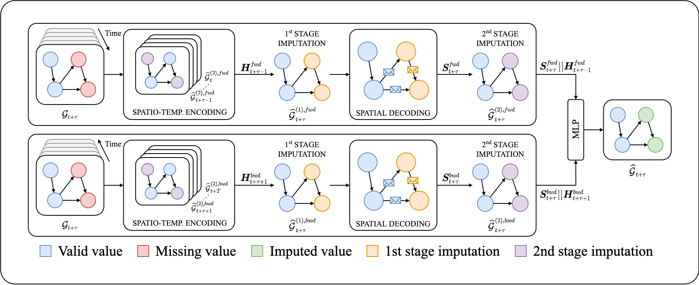

# Filling the G_ap_s: Multivariate Time Series Imputation by Graph Neural Networks (ICLR 2022 - [open review](https://openreview.net/forum?id=kOu3-S3wJ7) - [pdf](https://openreview.net/pdf?id=kOu3-S3wJ7))

[](https://openreview.net/forum?id=kOu3-S3wJ7)
[](https://openreview.net/pdf?id=kOu3-S3wJ7)
[](https://arxiv.org/abs/2108.00298)

This repository contains the code for the reproducibility of the experiments presented in the paper "Filling the G_ap_s: Multivariate Time Series Imputation by Graph Neural Networks" (ICLR 2022). In this paper, we propose a graph neural network architecture for multivariate time series imputation and achieve state-of-the-art results on several benchmarks.

**Authors**: [Andrea Cini](mailto:andrea.cini@usi.ch), [Ivan Marisca](mailto:ivan.marisca@usi.ch), Cesare Alippi


**‼️ PyG implementation of GRIN is now available inside [Torch Spatiotemporal](https://github.com/TorchSpatiotemporal/tsl), a library built to accelerate research on neural spatiotemporal data processing methods, with a focus on Graph Neural Networks.**

---

<h2 align=center>GRIN in a nutshell</h2>

The [paper](https://arxiv.org/abs/2108.00298) introduces __GRIN__, a method and an architecture to exploit relational inductive biases to reconstruct missing values in multivariate time series coming from sensor networks. GRIN features a bidirectional recurrent GNN which learns __spatio-temporal node-level representations__ tailored to reconstruct observations at neighboring nodes.

<p align=center>
  <a href="https://github.com/marshka/sinfony">
    
  </a>
</p>

---

## Directory structure

The directory is structured as follows:

```
.
├── config
│   ├── bimpgru
│   ├── brits
│   ├── grin
│   ├── mpgru
│   ├── rgain
│   └── var
├── datasets
│   ├── air_quality
│   ├── metr_la
│   ├── pems_bay
│   └── synthetic
├── lib
│   ├── __init__.py
│   ├── data
│   ├── datasets
│   ├── fillers
│   ├── nn
│   └── utils
├── requirements.txt
└── scripts
    ├── run_baselines.py
    ├── run_imputation.py
    └── run_synthetic.py

```
Note that, given the size of the files, the datasets are not readily available in the folder. See the next section for the downloading instructions.

## Datasets

All the datasets used in the experiment, except CER-E, are open and can be downloaded from this [link](https://mega.nz/folder/qwwG3Qba#c6qFTeT7apmZKKyEunCzSg). The CER-E dataset can be obtained free of charge for research purposes following the instructions at this [link](https://www.ucd.ie/issda/data/commissionforenergyregulationcer/). We recommend storing the downloaded datasets in a folder named `datasets` inside this directory.

## Configuration files

The `config` directory stores all the configuration files used to run the experiment. They are divided into folders, according to the model.

## Library

The support code, including the models and the datasets readers, are packed in a python library named `lib`. Should you have to change the paths to the datasets location, you have to edit the `__init__.py` file of the library.

## Scripts

The scripts used for the experiment in the paper are in the `scripts` folder.

* `run_baselines.py` is used to compute the metrics for the `MEAN`, `KNN`, `MF` and `MICE` imputation methods. An example of usage is

	```
	python ./scripts/run_baselines.py --datasets air36 air --imputers mean knn --k 10 --in-sample True --n-runs 5
	```

* `run_imputation.py` is used to compute the metrics for the deep imputation methods. An example of usage is

	```
	python ./scripts/run_imputation.py --config config/grin/air36.yaml --in-sample False
	```

* `run_synthetic.py` is used for the experiments on the synthetic datasets. An example of usage is

	```
	python ./scripts/run_synthetic.py --config config/grin/synthetic.yaml --static-adj False
	```

## Requirements

We run all the experiments in `python 3.8`, see `requirements.txt` for the list of `pip` dependencies.

## Bibtex reference

If you find this code useful please consider to cite our paper:

```
@inproceedings{cini2022filling,
    title={Filling the G\_ap\_s: Multivariate Time Series Imputation by Graph Neural Networks},
    author={Andrea Cini and Ivan Marisca and Cesare Alippi},
    booktitle={International Conference on Learning Representations},
    year={2022},
    url={https://openreview.net/forum?id=kOu3-S3wJ7}
}
```
